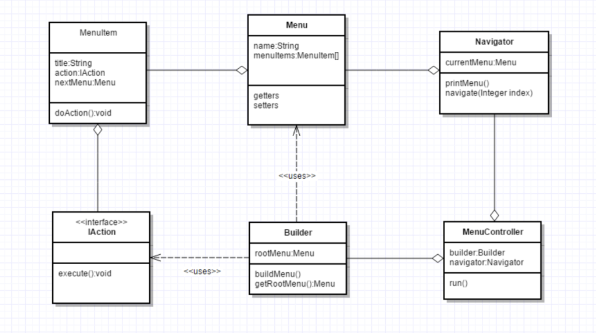

# igor-taren-repo

Igor Taren's repository

## Task #5

### _Add interface module (UI) to Electronic hotel administrator_

#### Description:

### Task 5.1 (difficulty 10)

Add a user interface module (UI) to the program from the previous task. The module should contain a user console
interface and allow you to fully perform all the functions included in the program. To refactor the entire program code
to bring it into compliance with the principles of MVC. Example of console interface implementation:

#### Task Requirements:

The resulting output program must comply with the principles of OOP and the MVC template;
It is desirable to use the following design patterns in the UI module:
Singleton;
Abstract factory.
Use Enum for sets of constants;

### Task 5.2 (difficulty 3)

Replace the use of arrays in the program from the previous homework with the Collection API.
You can use the Stream API and lambda expressions.

### HOWTO run

run from module *hotel-ui->MenuMain.class*

#### Stack

- Java 11;
- Lombok;

#### UML

[TASK_5.puml](TASK_5.puml)