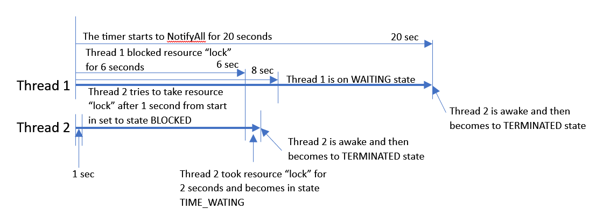

# igor-taren-repo

Igor Taren's repository

## TASK#9

### _Multithreading_

#### Description:

### Task Requirements:

All tasks are performed in a separate project, in a new task-9 branch.

### Task 9.1 (difficulty 3) "ThreadState"

It is necessary to create a new thread and reproduce all its states by displaying them in the console. Required states:

NEW,
RUNNABLE,
BLOCKED,
WAITING,
TIMED_WAITING,
TERMINATED;

#### Graph description for Task 9.1

### Task 9.2 (difficulty 2) "ThreadAlternator"

Create 2 threads that will take turns to output their name to the console.

### Task 9.3 (difficulty 5) "ProducerConsumer"

Write a program containing two threads – producer and consumer. The producer will generate random numbers, the consumer
will consume them. Two threads share a common data buffer, the size of which is limited. If the buffer is empty,
the consumer must wait for the data to appear in it. If the buffer is full, the producer must wait for the consumer
to take the data and free up space.

### Task 9.4 (difficulty 2) "TimeGenerator"

Create a service thread that will output the system time every n seconds. The number n is set via the flow constructor.