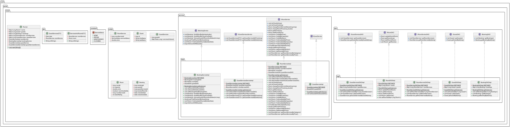

# igor-taren-repo

Igor Taren's repository

## Task #4

### _Electronic hotel administrator_

#### Description:

1. Electronic hotel administrator.

The program should allow you to show:

- List of rooms (sort by price, by capacity, by number of stars);
- List of available rooms (sort by price, by capacity, by number of stars);
- List of guests and their rooms (sort alphabetically and by check-out date);
- Total number of available rooms;
- Total number of guests;
- List of rooms that will be available on a certain date in the future;
- The amount of payment for the room to be paid by the guest;
- View the last 3 guests of the room and the dates of their stay;
- View the list of guest services and their price (sort by price, by date);
- Prices of services and rooms (sort by section(category), by price);
- Show the details of a separate room.

The program should provide the opportunity to: (already done)

- Check in to the room;
- Check out from the room;
- Change the status of the room to repaired/serviced;
- Change the price of a room or service;
- Add a room or service.

2. Assemble the program written during the previous task into an executable Jar file.
   Assemble the catalog of the finished program and create .bat/.sh the file to run the program.
   The program directory should have the following structure:

program_folder

|--- program.jar

|--- run.bat

Task Requirement:

The archive of the folder with the assembled program and the startup file should be embedded in GIT in the appropriate
branch.

Implementation:

root folder -> run.zip

#### Requirements

- DO NOT implement console user interface to the program. Verify that the program works from a test class with the main
  method;
- A class diagram must be created for the program;
- The program must comply with OOP principles and "Strong Binding" and "Weak Binding" patterns;
- Use System.out.println(message) to output the results;
- The .java source files must be injected into GIT in the appropriate branch.

#### Stack

- Java 11;
- Lombok;

#### UML

