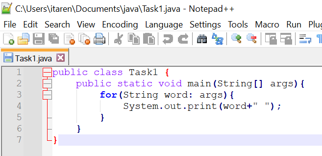
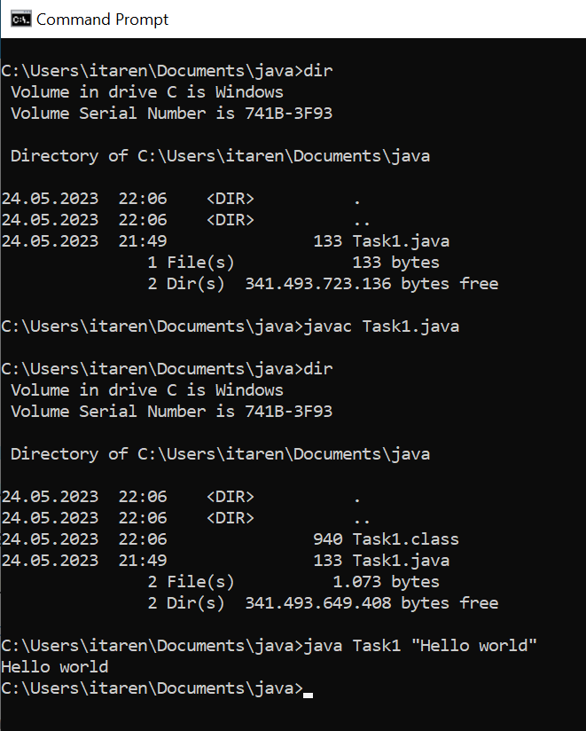

# igor-taren-repo
Igor Taren's repository

## Task #1

### Description:

Simple app to output a message to console. 
The text of output message is an argument of java app exececution.

### Example:

>java Task1 "Hello World!!!"

output -> Hello World!!!

### Code:

### Console:
