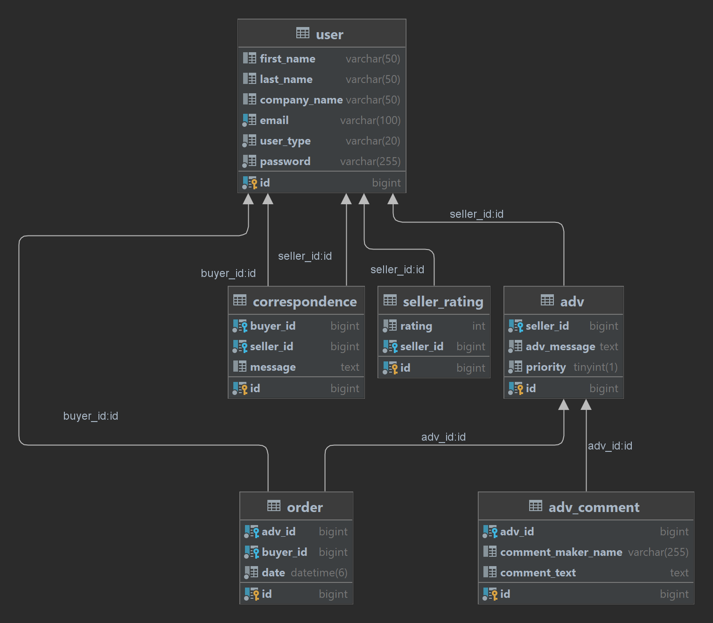

# igor-taren-repo

Igor Taren's repository

# FINAL TASK - Private Ads Placement System

## Theory:

- JUnit
- Spring IOC
- Hibernate

## Task:

Develop a Restful WEB project that fully implements one of the sets of requirements described below.
A web interface is not required; it is sufficient to implement an API for access through Postman/Insomnia.

## Description

- User registration in the system (user and administrator).
- Profile editing.
- View a list of advertisements. Search and filtering.
- Ability to add/edit/delete ads.
- Ability to leave comments under ads.
- Organization of private correspondence between buyer and seller.
- Ability to pay for placing an ad at the top of the search results.
- Seller rating system influencing the position of seller ads in search results. The lower the rating, the lower the ad
  in the results.
- User sales history.

## General Requirements for the Assignment:

#### Mandatory:

- The assignment must adhere to all canonical principles of writing Java programs and Java naming conventions.
- Adherence to MVC principles.
- Adherence to the principles of "High Cohesion" and "Loose Coupling."
- Well-thought-out modular structure (package structure).
- Reasonable use of multiple design patterns.
- Have a database diagram.
- The database must be brought to at least the 3rd normal form.
- Have a database initialization script (SQL).
- Have JUnit tests covering the main functionality.
- Have an exception handling system.
- Have a multi-level logging system.
- Have scripts for automatically building the application into a ready-to-use WAR or JAR file.
- Have detailed, step-by-step documentation on installing and deploying the application.
- Have a detailed user and role system (e.g., regular user and administrator).

#### Preferred:

- Compliance with the planned deadlines (4 weeks).
- Sending emails about lost passwords (emails generated by Velocity).
- Presence of project documentation (Javadoc, good UML diagrams).
- Presence of data validation.
- Technical Requirements for the Assignment:

#### Mandatory:

- Use Hibernate or MyBatis for working with the database.
- Use Maven or Gradle.
- Use MySQL, Postgres, or Oracle (free limited version).
- Use Spring for configuring and implementing "inversion of control."
- Use JUnit for writing Unit tests.
- Use Spring Security for user authorization.

## Defense of the Assignment:

- For admission to defense, you need to:
- Pass theory exams.
- Complete all practical assignments.
- For defense, you need to prepare:
- Archive with the application.
- Scripts for building the application.
- Scripts for initializing the database.
- Documentation on installing the project.
- The required version of Tomcat (if used).

## During defense, you need to:

- Build the project into a WAR/JAR file using Maven/Gradle.
- Install the database using prepared scripts.
- Run the application in Tomcat.
- Demonstrate the functionality of all assignment points.
- Demonstrate the completion of all project requirements.
- Explain the structure and principles of the application.
- Demonstrate project documentation.
- Discuss the technologies used and their peculiarities.
- Answer all questions about the code of the application.

## The defense may be considered unsuccessful if:

- The project could not be built or run.
- Specification points are not fully completed or completed incorrectly.
- Mandatory requirements for the assignment are not fully completed or completed incorrectly.
- Lack of knowledge about the technologies used in the project.
- Lack of knowledge of the project code.

## An unfinished project can be accepted only if all of the following points are fulfilled:

- Excellent theoretical exams.
- Very good code and database design.
- Confident understanding of the code and project structure

## API

| Menu Item                                                  | ROLE   | Endpoint                                     | Description                                     |
|------------------------------------------------------------|--------|----------------------------------------------|-------------------------------------------------|
| user registration                                          | ANY    | `POST /api/any/users`                        | Request body: UserDto                           |
| get all ads filtered by (SELLER_NAME, RATING, DATE_POSTED) | ANY    | `GET /api/any/ads/{SORT_PARAM}`              | {SORT_PARAM} - SELLER_NAME, RATING, DATE_POSTED |
| leave comment to certain Ads                               | ANY    | `POST /api/any/ads/comment`                  | Request body: CommentDto                        |
| get all sellers and their ads sorted by seller rating      | ANY    | `GET /api/any/sellers/ads`                   |                                                 |
| user modification                                          | ADMIN  | `PUT /api/admin/users`                       | Request body: UserDto                           |
| get user by ID                                             | ADMIN  | `GET /api/admin/users/{id}`                  | {id} - user ID                                  |
| get all sellers                                            | ADMIN  | `GET /api/admin/sellers`                     |                                                 |
| get all buyers                                             | ADMIN  | `GET /api/admin/buyers`                      |                                                 |
| get sales history of all sellers within the date range     | ADMIN  | `GET /api/admin/sales/{DATE_FROM}/{DATE_TO}` | {DATE_FROM} - date from, {DATE_TO} - date to    |
| add new Ads                                                | SELLER | `POST /api/seller/ads`                       | Request body: AdsDto                            |
| edite Ads                                                  | SELLER | `PUT /api/seller/ads`                        | Request body: AdsDto                            |
| delete Ads                                                 | SELLER | `DELETE /api/seller/ads/{id}`                | {id} - ads ID                                   |
| pay for placing ads to top                                 | SELLER | `POST /api/seller/ads/top/{id}`              | {id} - ads ID                                   |
| get all seller sales                                       | SELLER | `GET /api/seller/sales`                      |                                                 |
| send private message to buyer                              | SELLER | `POST /api/seller/buyer/message`             | Request body: MessageToBuyerDto                 |
| order ads                                                  | BUYER  | `POST /api/buyer/orders`                     | Request body: OrderDto                          |
| get all buyer orders                                       | BUYER  | `GET /api/buyer/orders`                      |                                                 |
| send private message to seller                             | BUYER  | `POST /api/buyer/seller/message`             | Request body: MessageToSellerDto                |

## DB scheme

