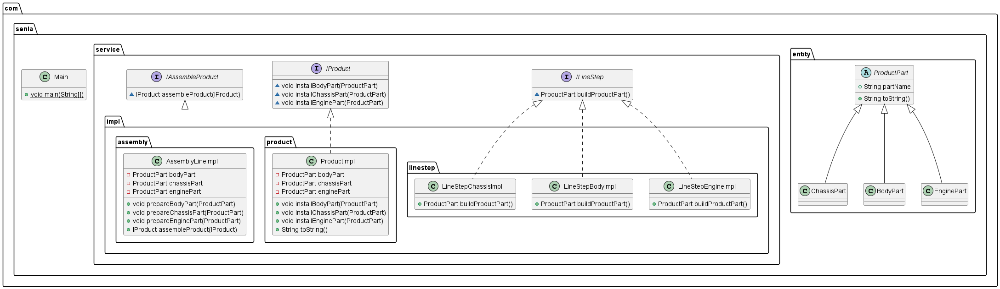

# igor-taren-repo
Igor Taren's repository
## Task #3.3
### Description:

Implement an object assembly line that implements the interfaces shown in the following diagram:

The task of an assembly line is to assemble complex products consisting of 3 parts. A specialised class (implementing ILineStep) must be used to set up each part, which supplies the required part via the buildProductPart() method. To assemble a product, its blank is passed to the assembleProduct() method. Inside this method, the line receives the 3 necessary components and "sets" them into the corresponding methods of the resulting product. Once the "assembly" is complete, the finished product is returned from the assembleProduct() method.

Variants of assembly lines:
- Cars (body, chassis, engine)
- Tanks (body, engine, turret)
- Laptops (body, motherboard, monitor)
- Automatic ballpoint pens (casing, spring, pin)
- Glasses (body, lens, temple)

Implement a separate test class with the main() method to build an assembly line with all of its steps, and test it by launching a single product for assembly.
The whole assembly process should be displayed to the user on the console in detail.

Requirements for implementation:

3 references to the required assembly steps must be passed to the assembly line designer

Use IDE for development

For message output use - System.out.println("MESSAGE_TEXT");

### Stack

- Java 11;

### UML

