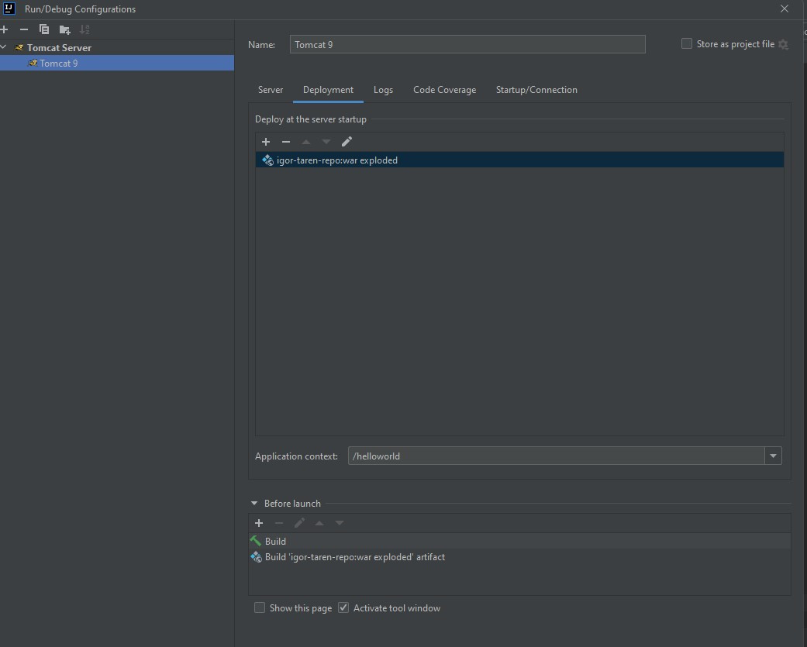

#### _igor-taren-repo_

### TASK#15

### _Web_

#### Description:

Task 15 (difficulty 3)

- Install Apache Tomcat 8+.

- Create a Servlet-based-webapp branch. The branch must be from the first commit of the master branch.

- Make HelloWorld a web application consisting of a single servlet. The application must accept a GET request to the URI
  /hello and return the string “Hello world” in response.

- This application should be assembled in war (specified in pom.xml <packaging>war</packaging>) and deployed on Apache
  Tomcat.

(optional, but highly recommended) Add a tomcat plugin to the HelloWorld project, with which to perform deploy/undeploy
on/from Tomcat.

#### Stack

- java 17
- apache-tomcat 9.0.82
- jakarta.servlet-api 4.0.4
- tomcat7-maven-plugin 2.2

#### Application start procedure 

- via tomcat7-maven-plugin

mvn clean install    
mvn tomcat7:deploy  
follow -> http://localhost:8080/helloworld

- via ide run

