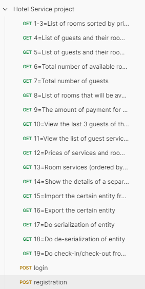

#### _igor-taren-repo_

# HOTEL SERVICE

### TASK#17

### _Spring Security_

#### Description:

Task 17 (difficulty 10)

- Modify the existing database schema so that it is possible to store the user and his login, password, role and/or list
  of privileges;
- Think over the division into an administrator and a ”regular user” for existing endpoints;
- Connect the necessary Spring Security dependencies and create a configuration class.
- Don't forget that you need a Filter to work with Security.

Configure Security according to points 2 and 5;
To choose from (priority b):

- a) Implement access rights differentiation based on JSESSIONID (Stateful is a variant of communication with the
  server), which works as follows: the user logs in once, setting up a session on the server,
  and then accesses http endpoints in accordance with the rights;
- b) Implement access rights differentiation based on a JWT token (Stateless is a variant of communication with the
  server).
  It should work like this: when logging in, a JWT token is obtained, and then, with each request to the server,
  this token is indicated in the headers header:Authorization to determine user rights. With this approach,
  no session is created or stored on the server. To generate a JWT token, use any library.

To implement point 5, write one or more of your own filters. As a basis (as a parent class), you can take the standard
UsernamePasswordAuthenticationFilter or BasicAuthenticationFilter from Spring, but not necessarily these ones -
a more interesting option is also possible at your discretion.

Implement the correct output of messages to the user that he does not have rights or he could not log in to the system.

#### Stack

- java.version 17
- apache-tomcat 10.1.15
- maven.compiler.plugin.version 3.11.0
- maven.surefire.plugin.version 3.1.2
- maven.checkstyle.plugin.version 3.3.0
- maven.site.plugin 3.12.0
- lombok.version 1.18.22
- gson.version 2.10.1
- jackson.annotations.version 2.15.2
- jackson.core.version 2.15.2
- jackson.databind.version 2.15.2
- mysql.connector.version 8.1.0
- maven.surefire-plugin.version 3.1.2
- maven.compiler-plugin.version 3.11.0
- logback.core.version 1.4.11
- slf4j.api.version 2.0.9
- logback.classic.version 1.4.11
- maven.checkstyle.plugin.version 3.3.0
- maven.site.plugin.version 3.12.0
- hibernate.core 6.3.1.Final
- spring-boot-starter 3.1.5
- spring-boot-starter-data-jpa 3.1.5
- spring-boot-maven-plugin 3.1.5
- spring-boot-starter-json 3.1.5
- spring-boot-starter-tomcat 3.1.5
- spring-boot-starter-test 3.1.5
- spring-boot-starter-data-rest 3.1.5
- spring-boot-starter-web 3.1.5
- spring-boot-starter-validation 3.1.5
- modelmapper 3.2.0
- java-jwt 4.4.0
- spring-security-core 6.1.5
- spring-security-config 6.1.5
- spring-security-web 6.1.5

#### REST API

context path -> /hotel

| Menu Item                                                                                                            | ROLE                   | Endpoint                                                                                 | Description                                                                  |
|----------------------------------------------------------------------------------------------------------------------|------------------------|------------------------------------------------------------------------------------------|------------------------------------------------------------------------------|
| 1=List of rooms sorted by price                                                                                      | ANY                    | `GET /hotel/api/any/rooms/sort?getOnlyAvailable={par1}&sortBy=PRICE&sortOrder={par2}`    | {par1}: `true/false` {par2}: `ASC/DESC`                                  |
| 2=List of rooms sorted by capacity                                                                                   | ANY                    | `GET /hotel/api/any/rooms/sort?getOnlyAvailable={par1}&sortBy=CAPACITY&sortOrder={par2}` | {par1}: `true/false` {par2}: `ASC/DESC`                                  |
| 3=List of rooms sorted by number of  stars                                                                       | ANY                    | `GET /hotel/api/any/rooms/sort?getOnlyAvailable={par1}&sortBy=RATING&sortOrder={par2}`   | {par1}: `true/false` {par2}: `ASC/DESC`                                  |
| 4=List of guests and their rooms  sorted alphabetically                                                          | ROLE_ADMIN             | `GET /hotel/api/admin/guests/rooms/alphabet`                                             |                                                                              |
| 5=List of guests and their rooms  sorted by check-out date                                                       | ROLE_ADMIN             | `GET /hotel/api/admin/guests/rooms/checkout`                                             |                                                                              |
| 6=Total number of available rooms                                                                                    | ROLE_ADMIN             | `GET /hotel/api/admin/rooms/available`                                                   |                                                                              |
| 7=Total number of guests                                                                                             | ROLE_ADMIN             | `GET /hotel/api/admin/guests/total`                                                      |                                                                              |
| 8=List of rooms that will be  available on a certain date in the future                                          | ANY                    | `GET /hotel/api/any/rooms/{par1}`                                                        | {par1}: date format `dd-MM-yyy`                                              |
| 9=The amount of payment for the room  to be paid by the guest                                                    | ROLE_GUEST, ROLE_ADMIN | `GET /hotel/api/guest/room/payment/byGuestId/{par1}`                                     | {par1}: number `long` format                                                 |
| 10=View the last 3 guests of the room  and the dates of their stay                                               | ROLE_ADMIN             | `GET /hotel/api/admin/last/guestAmount/{par1}/room/{par2}`                               | {par1}: number `long` format  {par2}: number `long` format               |
| 11=View the list of guest services  and their price (sorted by PRICE,DATE) in ASC(DESC) manner                   | ROLE_GUEST, ROLE_ADMIN | `GET /hotel/api/guest/guests/services?guestId={par1}&sortBy={par2}&sortOrder={par3}`     | {par1}: number `long` format {par1}: `PRICE/DATE` {par3}: `ASC/DESC` |
| 12=Prices of services and rooms  (sorted by CAPACITY,PRICE,AVAILABILITY,SERVICE,RATING)  in ASC(DESC) manner | ANY                    | `GET /hotel/api/any/rooms/prices?sortBy={par1}&sortOrder={par2}`                         | {par1}: `CAPACITY/PRICE/AVAILABILITY/SERVICE/RATING` {par2}: `ASC/DESC`  |
| 13=Room services (ordered by ROOM_SERVICES,PRICE)  in ASC(DESC) manner                                           | ANY                    | `GET /hotel/api/any/rooms/services?sortBy={par1}&sortOrder={par2}`                       | {par1}: `ROOM_SERVICES/PRICE` {par2}: `ASC/DESC`                         |
| 14=Show the details of a separate room                                                                               | ROLE_ADMIN             | `GET /hotel/rooms/{par1}`                                                                | {par1}: number `long` format                                                 |
| 15=Import the certain entity from the CSV file                                                                       | ROLE_ADMIN             | `GET /hotel/api/admin/csv/importing/{par1}`                                              | {par1}: `BOOKING/GUEST/GUESTSERVICE/ROOM/ROOMSERVICE`                        |
| 16=Export the certain entity                                                                                         | ROLE_ADMIN             | `GET /hotel/api/admin/csv/exporting/{par1}`                                              | {par1}: `BOOKING/GUEST/GUESTSERVICE/ROOM/ROOMSERVICE`                        |
| 17=Do serialization of entity                                                                                        | ROLE_ADMIN             | `GET /hotel/api/admin/serialization/{par1}`                                              | {par1}: `BOOKING/GUEST/GUESTSERVICE/ROOM/ROOMSERVICE`                        |
| 18=Do de-serialization of entity                                                                                     | ROLE_ADMIN             | `GET /hotel/api/admin/deserialization/{par1}`                                            | {par1}: `BOOKING/GUEST/GUESTSERVICE/ROOM/ROOMSERVICE`                        |
| 19=Do check-in/check-out from the room                                                                               | ROLE_ADMIN             | `GET /hotel/api/admin/rooms/operation/{par1}/{par2}`                                     | {par1}: `checkin/checkout` {par2}: number `long` format                  |
| User login                                                                                                           | ANY                    | `POST /hotel/api/any/login` Request body: `{"login":{par1},"password":{par2}}`           | {par1}:email, {par2}:password                                                |

All the entities have the main CRUD endpoints

| Endpoint                    | ROLE        | Description                       |
|-----------------------------|-------------|-----------------------------------|
| `GET /hotel/entity`         | ROLE_ADMIN  | Retrieve a list of entities.      |
| `GET /hotel/entity/{id}`    | ROLE_ADMIN  | Retrieve a specific entity by ID. |
| `POST /hotel/entity`        | ROLE_ADMIN  | Create a new entity record.       |
| `PUT /hotel/entity/{id}`    | ROLE_ADMIN  | Update an entity record.          |
| `DELETE /hotel/entity/{id}` | ROLE_ADMIN  | Delete an entity record.          |

entity -> `booking/guest/guestservice/room/roomservice`

#### passwords

| User                                  | Password   |
|---------------------------------------|------------|
| `admin@mail.com`                      | `admin`    | 
| any other guest -> login: guest email | `guest`    | 

#### DB schema

#### attachments

export of requests from Postman application -> [POSTMAN export](Hotel Service project.postman_collection.json)

postman screenshot

#### application start

- start tomcat(10.1.15) -> catalina.bat start
- _mvn clean package_
- _mvn -pl hotel-web tomcat7:deploy_
- use API above 